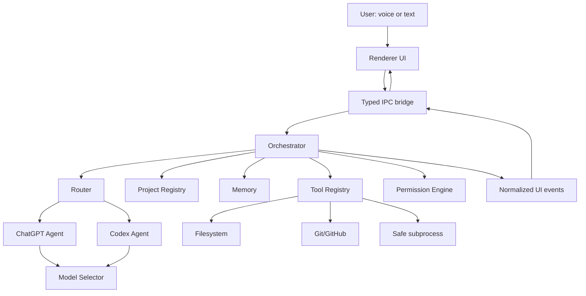

# Jarvis Architecture

## Architectural goal
Jarvis is one desktop application with a unified conversation and task surface. ChatGPT and Codex are specialized agents behind an orchestration layer rather than separate products in the UI.

## Process trust boundary

### Renderer process: untrusted presentation layer
Responsibilities:
- React UI and state rendering.
- Text input and message rendering.
- Hologram rendering and audio-reactive animation.
- Diff/task/status presentation.
- User permission prompts.

Prohibited:
- Reading API keys.
- Direct filesystem access.
- Direct shell/Git execution.
- Direct Codex or OpenAI SDK use.

Electron is configured with `contextIsolation: true`, `nodeIntegration: false`, and a narrow preload bridge.

### Main process: trusted application backend
Responsibilities:
- Orchestration.
- Agent adapters.
- OpenAI credentials.
- Codex SDK.
- Project registry and memory stores.
- Tool execution and permissions.
- Task cancellation.
- Audit logging.

## Why Electron instead of Tauri
Tauri remains viable, but Electron is the deliberate initial choice because the Codex SDK is TypeScript-native and wraps the Codex CLI. Keeping Codex, OpenAI API integration, safe subprocess control, Git, SQLite bindings, and orchestration in one trusted Node runtime removes a Rust-to-Node sidecar boundary and makes session/cancellation/event plumbing simpler.

The main security cost of Electron is addressed by keeping Node authority out of the renderer and exposing only explicit IPC methods through the preload script.

On Windows 11 build 26200, the main process applies a narrowly scoped Electron compatibility workaround for a Chromium GPU child-process sandbox regression. It keeps renderer sandboxing enabled and only changes GPU process placement/sandboxing; the workaround is isolated in the desktop main process and can be disabled with `JARVIS_DISABLE_WINDOWS_26200_WORKAROUND=1` for diagnostics.

This decision can be revisited if memory footprint becomes a material product constraint.

## Core package
`packages/core` contains pure domain logic:
- agent identifiers and task profiles;
- explicit agent parsing;
- intent-classifier abstraction;
- model selection;
- project alias resolution;
- orchestration event contracts.

It does not import Electron, React, OpenAI, SQLite, or filesystem APIs.

## Agent adapters
`packages/agents` implements agent interfaces.

### ChatGPT
The first vertical slice uses the OpenAI Responses API with streaming. Model choice is delegated to the model selector rather than hard-coded at the call site.

### Codex
Planned implementation uses `@openai/codex-sdk` in the main process. A Codex thread will be scoped to a registered repository and its lifecycle will be represented as an explicit task. SDK events will be normalized into public action/status events; private reasoning is never forwarded to the renderer or audit log.

## Model selection
Configuration stores symbolic slots such as `conversation_fast`, `reasoning`, `realtime_voice`, `coding`, and `coding_deep`. `AUTO` is resolved at runtime.

Initial current-capability defaults:
- low-latency simple text: GPT-5.6 Luna;
- balanced text reasoning: GPT-5.6 Terra;
- deep reasoning: GPT-5.6 Sol;
- realtime voice: resolved independently by the future voice adapter;
- Codex model: delegated to the Codex integration/configuration rather than the ChatGPT adapter.

Environment overrides can replace every resolved model without code changes.

## Routing design
Explicit addressing is deterministic and has highest priority. Automatic routing is behind `IntentClassifier`, allowing a rule-based local fallback today and a contextual model classifier later.

Automatic classification emits a `RouteDecision` containing:
- selected agent;
- confidence;
- reason suitable for UI/audit display;
- normalized user input with any explicit prefix removed.

## Project registry
Project aliases are normalized and resolved by a dedicated registry. Persistent storage will later move to SQLite, but alias resolution remains pure domain logic.

## Task model
Long-running work will use explicit task objects rather than implicit prompt chains. Task state will include agent, project, goal, phase, timestamps, cancellation token, tool activity, changed files, test results, and permission requests.

## Voice boundary
Voice is a transport and UI-state source, not an alternate orchestrator. The planned pipeline is:

`audio input -> local wake/VAD -> realtime transport -> transcript -> same router/orchestrator -> audio output`

This lets typed and spoken requests share routing, memory, permissions, projects, and tools.

## Persistence plan
SQLite is the planned local system of record for:
- conversations and messages;
- project registry;
- task history;
- structured memory records;
- Codex thread identifiers and session metadata;
- audit events.

Semantic/vector retrieval will only be added if structured + full-text retrieval proves insufficient.
